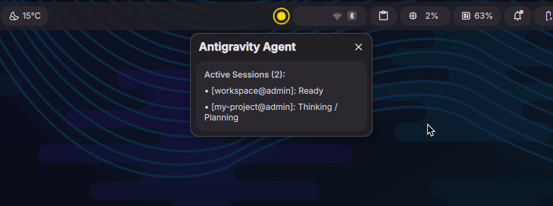

# 🚦 Antigravity Traffic Light

Real-time traffic light status indicator widget for **Google Antigravity (AGY)** agents.
Native cross-platform support for **Linux** (Dank Material Shell / Niri, Waybar, System Tray, Wayland Layer-Shell), **macOS** (Menu Bar), and **Windows** (Taskbar System Tray).

Displays the real-time activity of all your running agents (local and remote) right in your top bar, menu bar, or system tray.

<p align="center">
  
</p>

---

## 🎨 Traffic Light States

| State | Indicator | Description | Animation |
| :--- | :---: | :--- | :--- |
| **Needs Approval** | 🔴 **Red** | Agent waiting for user confirmation before executing tool | Fast Alert Pulse (0.5s) |
| **Working** | 🟡 **Yellow** | Agent thinking, planning, or executing a tool/command | Smooth Breathing Glow (1.0s) |
| **Idle / Ready** | 🟢 **Green** | Agent finished turn and is ready for next prompt | Solid Neon Glow |
| **Offline** | ⚪ **Grey** | No active agent sessions (or terminal closed) | Dim Outline |

---

## 🚀 Quick Start (Automated Setup)

### Linux
```bash
git clone https://github.com/cerXXXX/agy-traffic-light.git
cd agy-traffic-light
./scripts/install.sh
```

### macOS
```bash
git clone https://github.com/cerXXXX/agy-traffic-light.git
cd agy-traffic-light
./scripts/install-macos.sh
```
* Sets up hook plugin, installs dependencies, and enables `launchd` background LaunchAgent (`com.antigravity.traffic-light.plist`).
* Run `agy-traffic-tray` to display the real-time indicator in the macOS Menu Bar.

### Windows
Open PowerShell as your current user:
```powershell
git clone https://github.com/cerXXXX/agy-traffic-light.git
cd agy-traffic-light
powershell -ExecutionPolicy Bypass -File .\scripts\install.ps1
```
* Automatically creates NTFS plugin junction, installs package dependencies, and places background VBS runners in your Startup folder for seamless background operation without console windows.

> [!TIP]
> To uninstall or remove at any time, run `./uninstall.sh` (or `agy-traffic-uninstall`). See [Uninstallation / Removal](#-uninstallation--removal) below for all platforms.

---

## 🖥️ Desktop Integrations

> [!NOTE]
> **Reference Implementation:** Developed and verified on **Niri + Dank Material Shell (DMS)**.
> All other environments (macOS Menu Bar, Windows System Tray, Waybar, Standalone GTK) are fully implemented, but require community testing.

### 1. Dank Material Shell (DMS) / Niri *(Verified)*
* Native QML bar pill in DankBar with neon double-ring styling.
* Direction-aware popout card with active session details and configurable width.

### 2. System Tray & Menu Bar (macOS, Windows, Linux) *(Requires Testing)*
* Unified cross-platform applet via `agy-traffic-tray` (powered by `pystray`, with Ayatana fallback on Linux).
* Displays the live glowing indicator dot and active sessions menu in macOS Menu Bar, Windows Taskbar, and desktop trays (KDE, GNOME, XFCE).

### 3. Waybar & Standalone Wayland Overlays (Linux) *(Requires Testing)*
* **Waybar**: Native JSON module auto-configured into `config.jsonc` & `style.css`.
* **Standalone GTK Widget**: Floating layer-shell overlay for Sway, Hyprland, River, etc. (`--position top-right/bottom-right/etc.`).

---

## 🌐 Remote Agents Setup (SSH / VPS)

To monitor an agent running on a remote server:

1. **Install hook on remote server**:
   ```bash
   curl -sSL https://raw.githubusercontent.com/cerXXXX/agy-traffic-light/main/examples/remote/remote-install.sh | bash
   ```
2. **Connect via SSH with reverse port forwarding**:
   ```bash
   ssh -R 9876:localhost:9876 user@remote-server
   ```
Agent state changes forward securely over the SSH tunnel to your local traffic light.

---

## 🧪 Testing & Simulation

Simulate local agent lifecycle (🟡 Thinking -> 🟡 Running -> 🔴 Approval -> 🟢 Done):
```bash
python3 scripts/simulate.py --name "my-project"
```

Simulate a remote server agent:
```bash
python3 scripts/simulate.py --name "prod-api" --remote
```

---

## 🗑️ Uninstallation / Removal

To cleanly remove Antigravity Traffic Light, its background services, panel modules, and/or agent hook plugin:

### 1. Via CLI (Cross-Platform)
If installed as a Python package, run anytime from any directory:
```bash
agy-traffic-uninstall
# or directly via python:
python3 -m agy_traffic_light.uninstall
```

### 2. Via Repository Scripts

#### Linux
```bash
./scripts/uninstall.sh
# or simply from the repo root:
./uninstall.sh
```
* **Interactive menu**: Lets you choose between **Full Uninstall**, **Plugin Only**, or **Keep Python Package**.
* **Supported flags**:
  * `--plugin-only`: Only unlinks the hook plugin from Antigravity (`~/.gemini/config/plugins/agy-traffic-light`), leaving daemon, widgets, and status bar untouched.
  * `--keep-package`: Stops services and cleans desktop configurations, but leaves the Python package installed.
  * `-y, --yes`: Non-interactive mode (skips confirmation prompts).

#### macOS
```bash
./scripts/uninstall-macos.sh
```
* Unloads and removes LaunchAgent (`com.antigravity.traffic-light.plist`), terminates tray/daemon processes, unlinks the hook plugin, and uninstalls the Python package.
* Supports `--plugin-only`, `--keep-package`, and `-y`.

#### Windows
Open PowerShell as current user:
```powershell
powershell -ExecutionPolicy Bypass -File .\scripts\uninstall.ps1
```
* Stops background processes, removes startup VBS runners from your Startup folder, unlinks NTFS plugin junction, and uninstalls package.
* Supports `-PluginOnly`, `-KeepPackage`, and `-Force`.

#### Individual Desktop Integrations (Optional)
If you only want to remove a specific desktop widget:
* **Dank Material Shell (DMS)**: `bash examples/dms/uninstall-dms-plugin.sh`
* **Waybar**: `bash examples/waybar/uninstall-waybar.sh`

#### Remote SSH Server (Hook Only)
```bash
curl -sSL https://raw.githubusercontent.com/cerXXXX/agy-traffic-light/main/examples/remote/remote-uninstall.sh | bash
```

> [!NOTE]
> If you have active Antigravity CLI agent sessions running in open terminals, restart them after uninstalling so they release the hooks from memory.

---

## 📄 License

MIT License.

